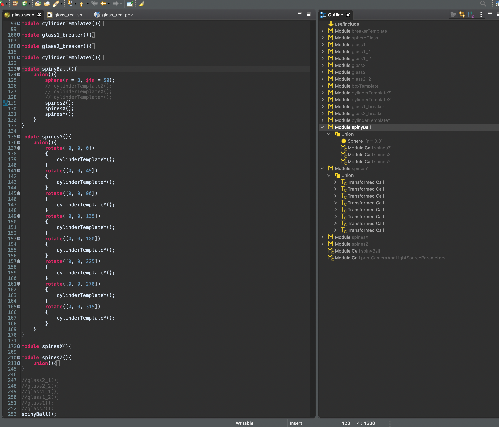
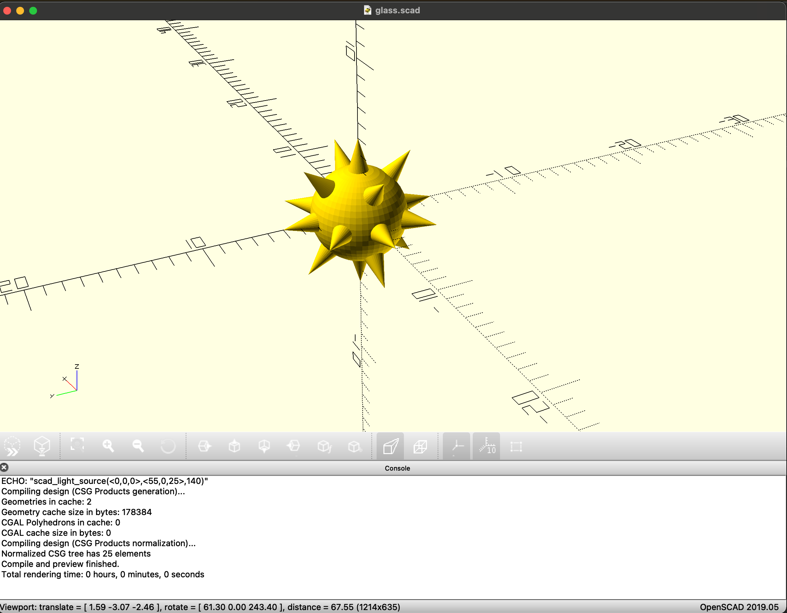
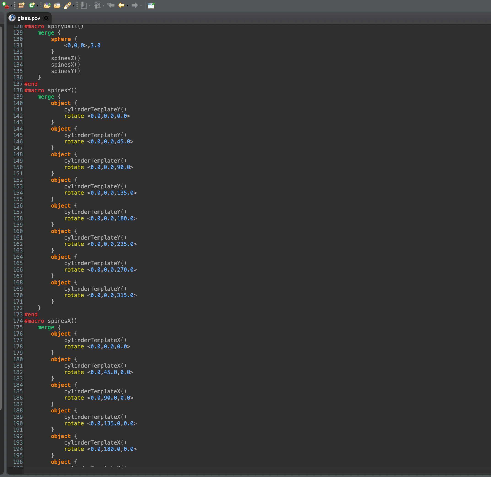

# scad2pov

Subset of [openscad](https://www.openscad.org/) as a DSL which translates to [povray](http://www.povray.org/).

Also experimental povray editor is included, as separate plugin:
   * code highlighting
   * code formatting

# Dependencies

* Eclipse (>4.15.0)
* Xtext & Xtend Plugin (>2.14.0)

# Usage

Please see the [scad2pov-example](https://github.com/erdinc09/scad2pov-example). 

1. write scad in eclipse (by using this plugin):

2. while writing scad, use [openscad](https://www.openscad.org/) to investigate the 3D model:

3. under the hood povray file is automatically generated (thanks to [Xtext Framework](https://www.eclipse.org/Xtext/)):

4. import the generated file in another povray file, apply some lighting and textures, without touching the imported file and render with [povray](http://www.povray.org/):

__NOTES:__

* You should define `POVRAY_SCAD_LIB=~/git/scad2pov/com.karalisoft.povray.scadlib` in your PATH. 

# Build From Source

0. Use Plugin Development version of eclipse. Install Xtext plugin.
1. In "com.karalisoft.scad" project, on the context menu of the file "/com.karalisoft.scad/src/com/karalisoft/GenerateScad.mwe2" "Run As" -\> "MWE2 Workflow"
2. After successful build, selecting two feature projects export as "Deployable Features".
3. In the "options" tab, check the "Categorize repository" and select the category file (.xml) in the project "com.karalisoft.scad.repository".
4. Export.

# Disclaimer

  Copyright (c) 2020-2021 Ahmet Erdinç Yılmaz -- <ahmeterdinc09@gmail.com>
 
  This program is free software; you can redistribute it and/or modify
  it under the terms of the GNU Affero General Public License as published by
  the Free Software Foundation; version 3 of the License.
 
  This program is distributed in the hope that it will be useful, but
  WITHOUT ANY WARRANTY; without even the implied warranty of MERCHANTABILITY
  or FITNESS FOR A PARTICULAR PURPOSE. See the GNU Affero General Public License
  for more details.

